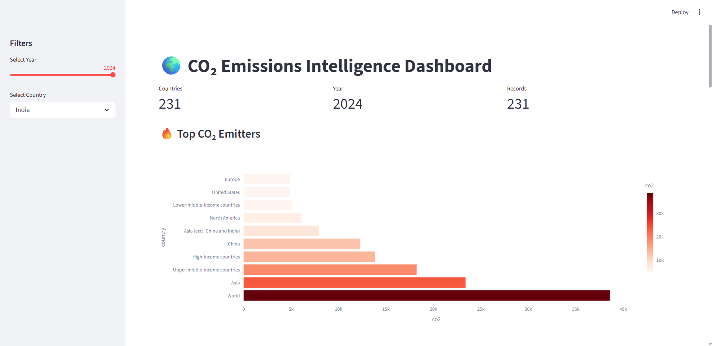
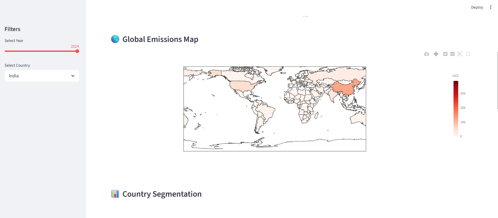
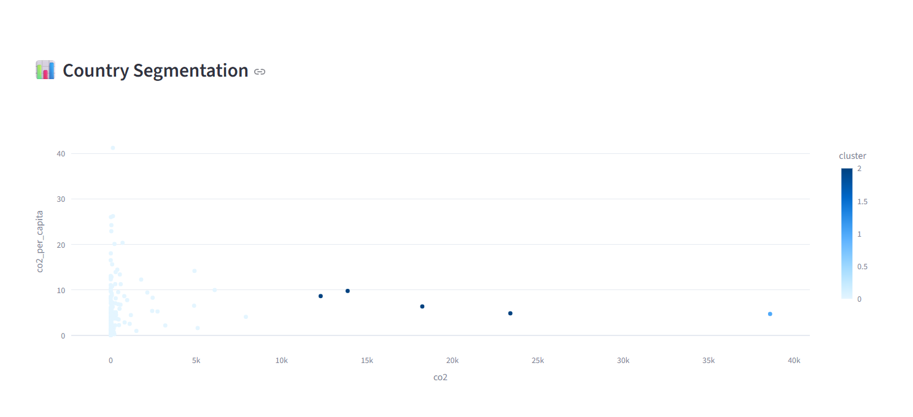
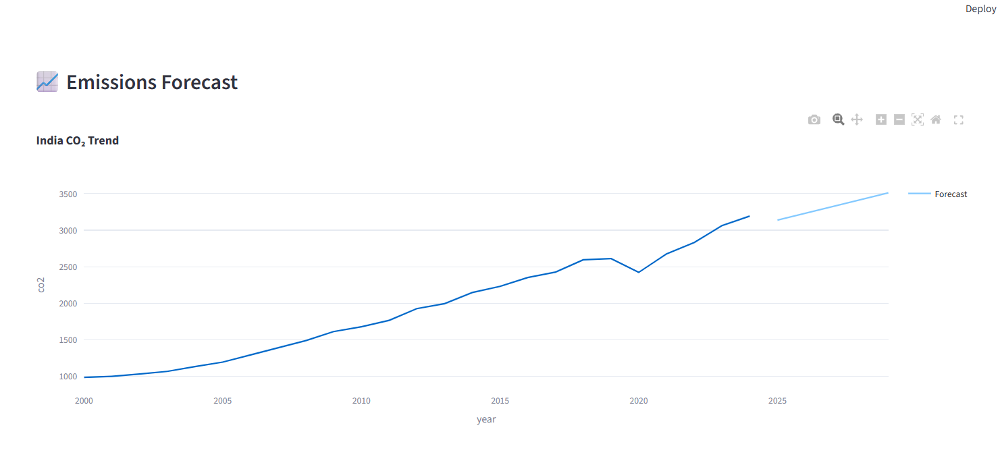

# 🌍 CO₂ Emissions Intelligence Dashboard

## 🚀 Why this project?

Understanding global CO₂ emissions is critical for climate policy, sustainability, and environmental planning.
This project provides an interactive data science platform to explore emission trends, identify high-impact countries, and forecast future patterns using machine learning techniques.

---

## 📌 Overview

This project presents an end-to-end data science solution for analyzing global CO₂ emissions. It integrates data processing, machine learning, and interactive visualization into a unified dashboard.

Users can:

* Explore emissions data across countries and years
* Identify high-emission regions
* Understand emission disparities
* Analyze trends and future projections

---

## 🎯 Key Features

* 📊 Exploratory Data Analysis (EDA) on global emissions data
* 🌎 Interactive choropleth map for country-wise emissions
* 🧠 Country segmentation using K-Means clustering
* 📈 Trend-based forecasting of CO₂ emissions
* 🎬 Animated visualization of global emissions over time
* 🎛️ Country-level filtering and dynamic analysis
* 📊 Fully interactive dashboard using Streamlit

---

## 🛠️ Tech Stack

* **Programming:** Python
* **Data Processing:** Pandas, NumPy
* **Machine Learning:** Scikit-learn (K-Means Clustering)
* **Visualization:** Plotly
* **Framework:** Streamlit

---

## 📂 Dataset

* Source: Our World in Data (OWID)
* Contains country-wise CO₂ emissions and related indicators
* Covers multiple years enabling trend and forecasting analysis

---

## 🧩 Project Structure

```
co2-emissions-intelligence-dashboard/
│
├── app.py              # Streamlit dashboard
├── analysis.py         # Data preprocessing & analysis
├── model.py            # Clustering & forecasting logic
├── requirements.txt
├── README.md
│
├── data/
│   └── co2.csv
│
├── screenshots/
│   ├── dashboard.png
│   ├── map.png
│   ├── cluster.png
│   ├── forecast.png
```

---

## 📈 Forecasting Approach

A lightweight trend-based regression model is used to estimate future CO₂ emissions based on historical data.
This approach ensures fast computation while maintaining interpretability of results.

---

## 🌐 Live Demo

https://co2-emissions-intelligence-dashboard-aryan.streamlit.app

---

## 📸 Dashboard Preview

### 🔹 Main Dashboard



### 🔹 Global Emissions Map



### 🔹 Country Clustering



### 🔹 Emissions Forecast



---

## 📊 Key Insights

* Identifies top CO₂ emitting countries globally
* Reveals clusters of countries based on emission behavior
* Highlights inequality through per capita emissions
* Shows increasing emission trends in developing economies
* Provides data-driven insights for environmental analysis

---

## 🔮 Future Improvements

* Implement advanced forecasting models (ARIMA, LSTM)
* Add continent-level and sector-wise analysis
* Improve prediction accuracy with more features
* Enhance UI with additional interactive controls

---

## 👨‍💻 Author

**Aryan Prasad**
Computer Science Graduate | Aspiring Data Scientist

---

## 🔗 Repository

https://github.com/aryan-prasad22/co2-emissions-intelligence-dashboard
